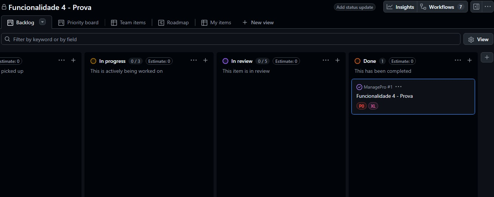

# ManagePro
Sistema web REST desenvolvido para gerenciamento de produtos, permitindo ao usuário cadastrar, listar e excluir produtos.

Projeto acadêmico do curso de **Análise e Desenvolvimento de Sistemas (ADS)**, da faculdade Impacta.

## 👥 Integrante

| Nome                                | RA      |
| ----------------------------------- | ------- |
| Andra Paula Carneiro de Jesus       | 2400093 |

## 📌 Gestão do Projeto

O acompanhamento das tarefas, sprints e progresso do projeto Foram feitos através do [Github Projects](https://github.com/orgs/Code-Elysium/projects/1/views/1?system_template=kanban)

## 🚀Tecnologias Utilizadas

### 🔧 Back-end

- Java 21
- Spring Boot 4.0.2
- Maven (Gerenciamento de dependências)

### 🗄️ Banco de Dados

- MySQL 8

### 🎨 Front-end

- HTML5
- CSS3
- JavaScript

### 🛠️ Ferramentas de Desenvolvimento e Apoio

- IntelliJ IDEA (IDE)
- Postman (Testes de API)
- HeidiSQL (Gerenciamento do banco de dados)
- 
